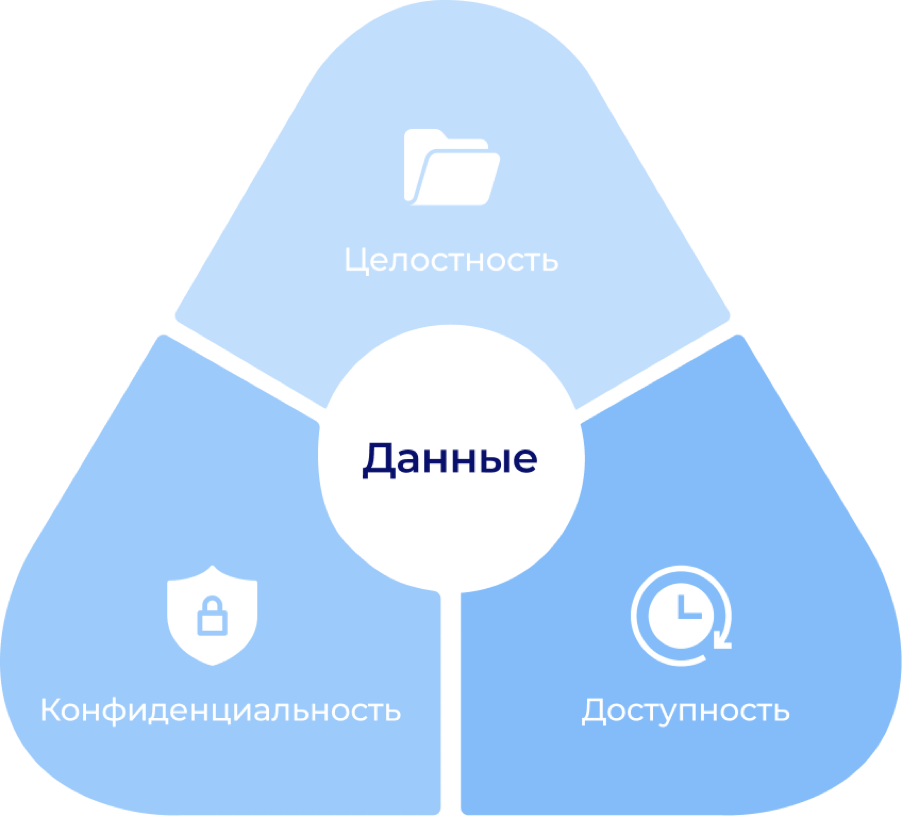
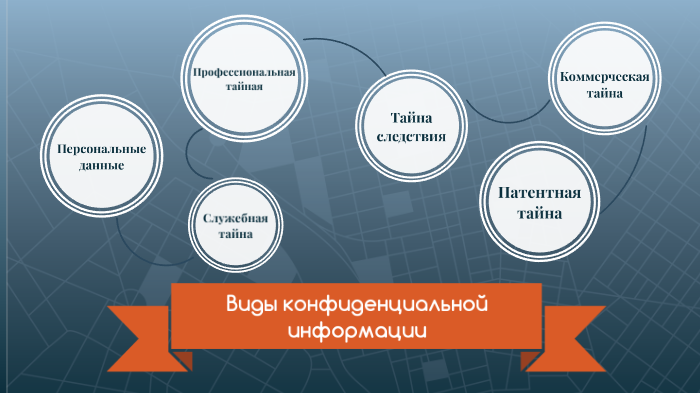

---
## Author
author:
  name: Трусова Алина Александровна
  email: 1132246715@rudn.ru
  affiliation:
    - name: Российский университет дружбы народов
      country: Российская Федерация
      postal-code: 117198
      city: Москва
      address: ул. Миклухо-Маклая, д. 6
## Title
title: Цели и задачи защиты информации. Организация защиты конфиденциальной информации
subtitle: Основы информационной безопасности
license: CC BY
date: today
date-format: "YYYY-MM-DD" # Example: 2025-09-06
---

# Информация

## Докладчик

:::::::::::::: {.columns align=center}
::: {.column width="70%"}

  * Трусова Алина Александровна
  * Студент
  * Российский университет дружбы народов им. П. Лумумбы
  * [1132246715@rudn.ru](mailto:1132246715@rudn.ru)
  * <https://alas-aline.github.io/>

:::
::: {.column width="30%"}

:::
::::::::::::::

# Вводная часть

## Актуальность

- Информационные активы —- ключевой ресурс
- Новые схемы мошенничества
- Недостаточная осведомлённость
- Растёт количество случаев кражи данных

## Объект и предмет исследования

- Информационная безопасность
- Криптография
- Входные и выходные форматы презентаций

## Цели и задачи

- Повысить осведомлённость об информационной безопасности
- Узнать о способах защиты информации

# Понятие информационной безопасности

## Что такое информационная безопасность?

Определение:

- Состояние защищенности информации и поддерживающей инфраструктуры
- Защита от случайных или преднамеренных воздействий
- Обеспечение нормального функционирования объекта

Нормативная база (РФ):

- Доктрина информационной безопасности РФ
- ГОСТ Р 50922-2006

## Базовые цели защиты информации (CIA Triad)

## Задачи системы защиты информации

:::::::::::::: {.columns align=center}
::: {.column width="70%"}

	Список задач:

	- Предотвращение утечек и несанкционированного доступа
	- Своевременное обнаружение инцидентов (мониторинг)
	- Минимизация последствий атак (восстановление)
	- Правовое регулирование отношений в области ИБ
	- Обучение персонала культуре безопасности

:::
::: {.column width="30%"}

:::
::::::::::::::

## Конфиденциальная информация: виды

# Система защиты конфиденциальной информации (СЗКИ)

## Принципы построения:

- Комплексность (сочетание мер)
- Непрерывность процесса
- Своевременность внедрения
- Разумная достаточность (баланс затрат и рисков)

## Этапы:

## Организационные меры защиты

Инструменты:

- Разработка нормативных документов (Политики, Инструкции)
- Режим пропускного контроля (физическая защита)
- Работа с персоналом (NDA, подписка о неразглашении)
- Управление доступом (принцип минимальных привилегий)
- Учет и маркировка носителей информации

## Технические средства защиты

- Средства идентификации и аутентификации: Пароли, токены, биометрия
- Средства разграничения доступа: СЗИ от НСД
- Средства криптографии: Шифрование каналов и данных (ЭЦП, VPN)
- Межсетевые экраны и антивирусы: Защита периметра
- DLP-системы: Предотвращение утечек данных

# Правовое регулирование в РФ

## Нормативно-правовая база (РФ)

Ключевые законы:

- ФЗ №149: «Об информации, информационных технологиях и о защите информации»
- ФЗ №152: «О персональных данных»
- ФЗ №98: «О коммерческой тайне»
- ФЗ №187: «О безопасности критической информационной инфраструктуры»
- Указы Президента и приказы ФСТЭК/ФСБ

# Выводы

