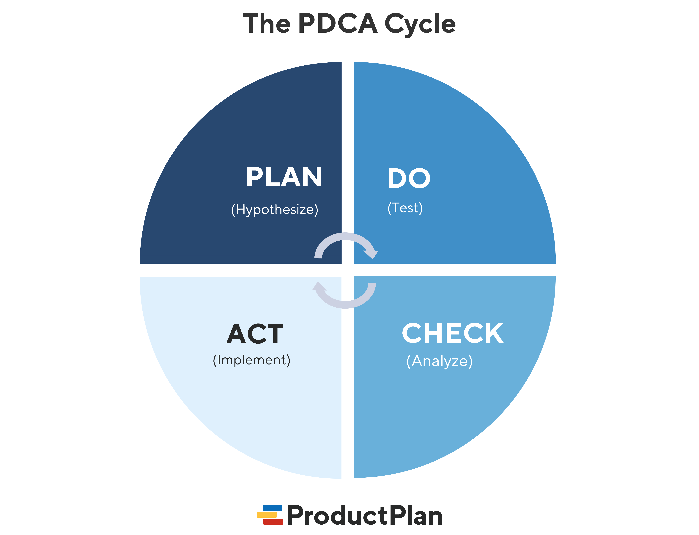

---
## Author
author:
  name: Трусова Алина Александровна
  email: 1132246715@rudn.ru
  affiliation:
    - name: Российский университет дружбы народов
      country: Российская Федерация
      postal-code: 117198
      city: Москва
      address: ул. Миклухо-Маклая, д. 6

## Title
title: "Цели и задачи защиты информации"
subtitle: "Основы информационной безопасности"
license: "CC BY"
---

# Цель работы

Повышение осведомлённости об информационной безопасности

# Задание

- Узнать о принципах и способах защиты информации

# Теоретическое введение

В современном мире информация стала таким же ценным ресурсом, как нефть или деньги. Однако вместе с цифровизацией растут и риски. Утечка клиентской базы, остановка производства из-за вируса-шифровальщика или кража коммерческой тайны могут привести к банкротству компании. Поэтому защита информации — это не просто «настройка антивируса», а стратегическая задача выживания организации.

Согласно ГОСТ, информационная безопасность это состояние защищенности информации и поддерживающей инфраструктуры от случайных или преднамеренных воздействий. Важно понимать: мы защищаем не только файлы на компьютере, но и процессы, людей и оборудование, которое эту информацию обрабатывает. В России эти вопросы регулируются Доктриной информационной безопасности и рядом государственных стандартов.

## Базовые цели защиты информации (CIA Triad)

Фундаментом всей защиты является так называемая «Триада ИБ».
Первое — Конфиденциальность. Информация не должна попасть к тем, у кого нет прав доступа.
Второе — Целостность. Данные не должны быть изменены несанкционированно или случайно.
Третье — Доступность. Легитимные пользователи должны иметь доступ к информации, когда она им нужна. Нарушение любого из этих принципов считается инцидентом безопасности ([рис. @fig-001]).

{#fig-001 width=70% fig-align="center"}

## Задачи системы защиты информации

Список задач:
Исходя из целей, формируются конкретные задачи. Главная задача — предотвратить инцидент. Но так как 100% защиты не существует, критически важны задачи обнаружения атаки в реальном времени и минимизации ущерба. Также нельзя забывать про «человеческий фактор» — одна из ключевых задач это обучение сотрудников, так как часто утечки происходят из-за ошибок персонала ([рис. @fig-002]).

{#fig-002 width=70% fig-align="center"}

## Конфиденциальная информация:

Перейдем к организации защиты. Сначала нужно понять, что мы защищаем. В России к конфиденциальной информации относятся несколько ключевых категорий. Это коммерческая тайна, которая дает преимущество бизнесу. Это персональные данные, защита которых строго регламентирована 152-м Федеральным законом. А также служебная и профессиональная тайны. Для каждого вида существуют свои требования к уровню защиты ([рис. @fig-003]).

{#fig-003 width=70% fig-align="center"}

# Система защиты конфиденциальной информации (СЗКИ)

## Принципы построения:

Организация защиты не может быть хаотичной. Необходим системный подход. Мы строим Систему защиты конфиденциальной информации. Ключевой принцип здесь — «разумная достаточность». Нет смысла ставить защиту уровня Пентагона в маленьком магазине, но и экономить на безопасности банка нельзя. Процесс цикличен: мы оцениваем риски, внедряем меры, проверяем их работу и снова анализируем риски ([рис. @fig-004]).

{#fig-004 width=70% fig-align="center"}

## Организационные меры защиты

Меры защиты делятся на организационные и технические. Организационные часто недооценивают, но они первичны. Это документы: положения, инструкции, которые регламентируют, как работать с данными. Это физический контроль доступа в помещения. Это юридическое оформление отношений с сотрудниками (NDA). Без налаженной организационной базы даже самые дорогие технические средства будут бесполезны.

## Технические средства защиты

Техническая реализация включает в себя широкий спектр инструментов. Для подтверждения личности используем сложные пароли или биометрию. Для защиты от несанкционированного доступа — специальные программы (СЗИ от НСД). Криптография защищает данные при передаче. Особое место занимают DLP-системы, которые контролируют, чтобы конфиденциальные файлы не были отправлены на личную почту или скопированы на флешку.

# Правовое регулирование в РФ

## Нормативно-правовая база (РФ)

В России организация защиты строго регламентирована законом. Основные документы, которые нужно знать: 149-ФЗ (базовый), 152-ФЗ (персональные данные), 98-ФЗ (коммерческая тайна). Также для госорганизаций и критической инфраструктуры действуют требования ФСТЭК и ФСБ. Несоблюдение этих норм влечет за собой административную и даже уголовную ответственность.

# Выводы

Подводя итоги, хочу подчеркнуть: защита конфиденциальной информации — это не состояние, а процесс. Он требует постоянного внимания, обновления средств и обучения людей. Только комплексный подход, сочетающий закон, организационный режим и технические средства, позволяет достичь главных целей ИБ. Помните, что стоимость предотвращения инцидента всегда ниже стоимости его ликвидации.

# Список литературы{.unnumbered}

::: {#refs}
:::
