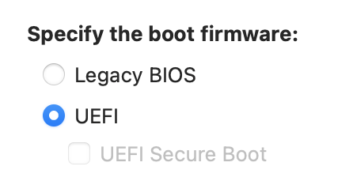
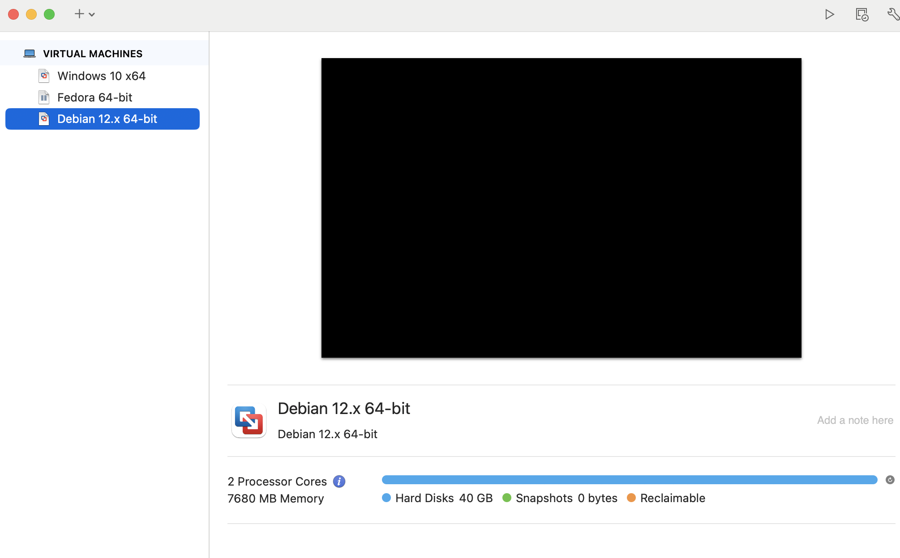
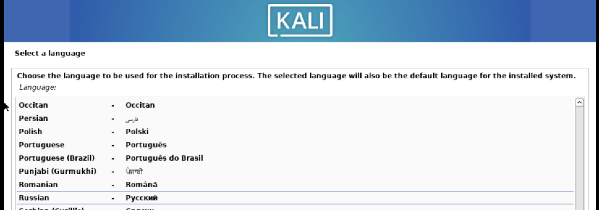
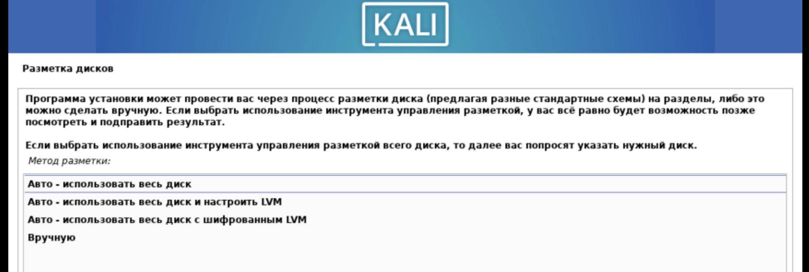
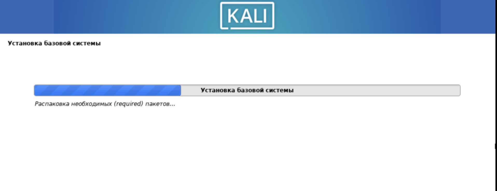
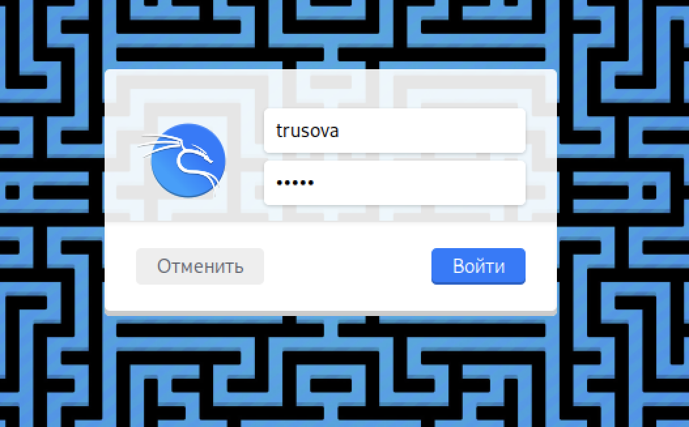

---
## Author
author:
  name: Трусова Алина Александровна
  email: 1132246715@rudn.ru
  affiliation:
    - name: Российский университет дружбы народов
      country: Российская Федерация
      postal-code: 117198
      city: Москва
      address: ул. Миклухо-Маклая, д. 6
## Title
title: Индивидуальный проект. 1 Этап
subtitle: Основы информационной безопасности
license: CC BY
date: today
date-format: "2026-03-07" # Example: 2025-09-06
---

# Информация

## Докладчик

:::::::::::::: {.columns align=center}
::: {.column width="70%"}

  * Трусова Алина Александровна
  * Студент а.г. НКАбд-04-24
  * Студ. билет: 1132246715
  * Российский университет дружбы народов им. П. Лумумбы
  * [1132246715@rudn.ru](mailto:1132246715@rudn.ru)
  * <https://github.com/alas-aline.io/ru/>

:::
::: {.column width="30%"}

:::
::::::::::::::

# Вводная часть

## Цели и задачи

- Установить Kali Linux

# Выполнение лабораторной работы

## Установка машины

Скачала нужный образ с официального сайта для своего мабука и для начала долго настраиваю машину ([рис. @fig-001]), ([рис. @fig-002]).

{#fig-001 width=70%}

## Установка машины

{#fig-002 width=70%}

## Установка ОС

А потом установка операционной системы ([рис. @fig-003]), ([рис. @fig-004]), ([рис. @fig-005]).

{#fig-003 width=70%}

## Установка ОС

{#fig-004 width=70%}

## Установка ОС

{#fig-005 width=70%}

## Установка ОС

В итоге система установилась ([рис. @fig-006]), ([рис. @fig-007]).

{#fig-006 width=70%}

## Установка ОС

{#fig-007 width=70%}

# Выводы

Kali Linux успешно установлена, looking forward for очередной step проекта.
